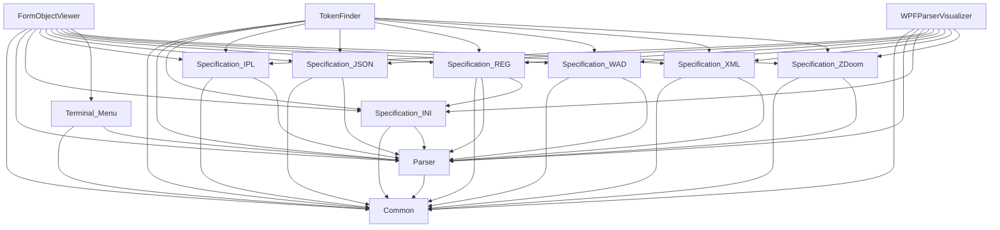

```mermaid
graph TD
    FormObjectViewer --> Common
    FormObjectViewer --> Parser
    FormObjectViewer --> Specification_INI
    FormObjectViewer --> Specification_IPL
    FormObjectViewer --> Specification_JSON
    FormObjectViewer --> Specification_REG
    FormObjectViewer --> Specification_WAD
    FormObjectViewer --> Specification_XML
    FormObjectViewer --> Specification_ZDoom
    FormObjectViewer --> Terminal_Menu
    Parser --> Common
    Specification_INI --> Common
    Specification_INI --> Parser
    Specification_IPL --> Common
    Specification_IPL --> Parser
    Specification_JSON --> Common
    Specification_JSON --> Parser
    Specification_REG --> Common
    Specification_REG --> Parser
    Specification_REG --> Specification_INI
    Specification_WAD --> Common
    Specification_WAD --> Parser
    Specification_XML --> Common
    Specification_XML --> Parser
    Specification_ZDoom --> Common
    Specification_ZDoom --> Parser
    Terminal_Menu --> Common
    Terminal_Menu --> Parser
    TokenFinder --> Common
    TokenFinder --> Parser
    TokenFinder --> Specification_INI
    TokenFinder --> Specification_IPL
    TokenFinder --> Specification_JSON
    TokenFinder --> Specification_REG
    TokenFinder --> Specification_WAD
    TokenFinder --> Specification_XML
    TokenFinder --> Specification_ZDoom
    WPFParserVisualizer --> Common
    WPFParserVisualizer --> Parser
    WPFParserVisualizer --> Specification_INI
    WPFParserVisualizer --> Specification_IPL
    WPFParserVisualizer --> Specification_JSON
    WPFParserVisualizer --> Specification_REG
    WPFParserVisualizer --> Specification_WAD
    WPFParserVisualizer --> Specification_XML
    WPFParserVisualizer --> Specification_ZDoom

```